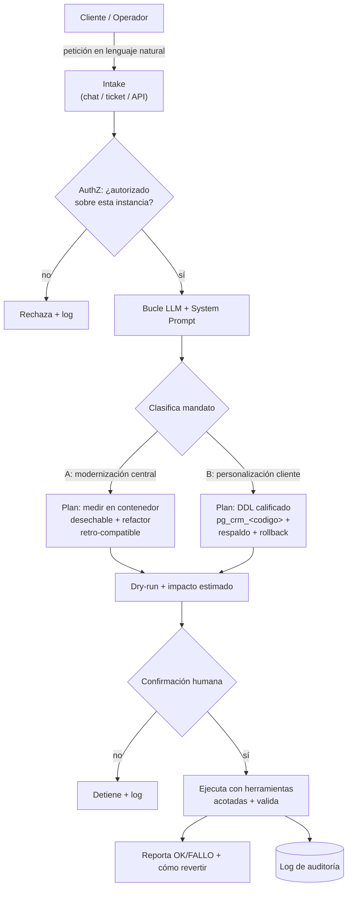

# PROMPTS Y AGENTE — Prueba Técnica Platzilla

Este documento cubre lo pedido en el enunciado:

1. **Auditoría** del código legacy y cómo se abordó.
2. **Iteraciones y consultas exactas a la IA**, incluyendo **cómo se resolvieron los errores**.
3. **Diseño del "System Prompt"** para un Agente de IA que gestione, sobre una arquitectura
   **multi-tenant de bases de datos individuales**, los **cambios por cliente** y las
   **migraciones estructurales** hacia **PHP 8.4 + MariaDB 10.5**, sin afectar a otras instancias.

> **Objetivo de modernización (según el enunciado):** llevar el código de **PHP 5.6 → PHP 8.4**
> y la base de datos de **MySQL 5.6 → MariaDB 10.5**. No se exige que el sitio quede 100 %
> funcional; se evalúa la calidad de lo modernizado y el criterio técnico.
>
> Documentos complementarios: `docs/AUDITORIA_MYSQL.md` (números) y
> `docs/BACKLOG_MODERNIZACION.md` (qué se dejó fuera y por qué).

---

## 1. Metodología: cómo se usó la IA

Se usó **Claude Code** (asistente de IA de Anthropic) como copiloto, con un método deliberado en
tres tiempos para **no romper código legacy que no se puede recompilar fácilmente**:

1. **Auditar antes de tocar** — medir el problema (cuántas llamadas, dónde, de qué tipo).
2. **Cambiar en incrementos verificables** — validar cada cambio contra la app corriendo.
3. **Documentar y versionar en pasos pequeños** — commits granulares en `development`, dejando
   `main` para la entrega final.
4. **Medir en real, no teorizar** — para la compatibilidad con PHP 8.4 y MariaDB 10.5 se
   levantaron **contenedores reales** (`php:8.4-cli/apache`, `mariadb:10.5`) y se **capturó qué
   falla de verdad**, en vez de asumir incompatibilidades de manual. Las sondas corren en
   contenedores desechables, sin tocar el stack vivo. Todo el análisis está en
   `docs/COMPATIBILIDAD_PHP84.md` y `docs/COMPATIBILIDAD_MARIADB105.md`.

---

## 2. Auditoría asistida por IA (resumen)

Detalle en `docs/AUDITORIA_MYSQL.md`. Titulares:

- **434** llamadas a la extensión legacy `mysql_*` (eliminada en PHP 7) en ~40 archivos: 35 en la
  librería `adodb/` y 399 en código de aplicación.
- Además, el análisis reveló otras incompatibilidades hacia PHP 8.4 concentradas sobre todo en
  **librerías**: `ereg`/`split` (~256), `each()` (~90), `create_function()` (~13), acceso con
  llaves `$var{...}` (~503).
- **Dos palancas de modernización aplicadas:**
  - **Palanca 1** — driver de BD `mysql` → `mysqli` (vía ADOdb): compatible con PHP 8.4 y con
    MariaDB 10.5, sin tocar las 434 llamadas.
  - **Palanca 2 (PoC)** — refactor manual del módulo `notificaciones.php` al wrapper ADOdb,
    validado funcionalmente.

**Segunda fase — modernización empírica hacia PHP 8.4 + MariaDB 10.5** (detalle en los `docs/`):

- **BD migrada de verdad a MariaDB 10.5:** el servicio `db` del compose pasó de `mysql:5.6` a
  `mariadb:10.5`; el sitio arranca y autentica contra 10.5 (HTTP 200), verificado end-to-end.
- **Hallazgos medidos (no teóricos):** el import no falla, pero `STRICT_TRANS_TABLES` rompe 75
  ENUM con `''` (saneados en `db_init/zz-sanitize-enums.sql`); las fechas cero **no** rompen
  (refutado por medición); `utf8→utf8mb4` topa con 64 FKs (`ERROR 1832`); en PHP 8.4 el código app
  se corrige progresivamente pero el arranque choca con **ADOdb** (librería → actualizar, no
  parchear).
- **Tandas de refactor retro-compatible** (validadas con `php -l` en 8.4 **y** 5.6): offsets
  `$var{}`→`$var[]`, `&new`→`new`, `create_function`→`eval`/closures, `each()`→`foreach`,
  `utf8_encode`→`mb_convert_encoding`.
- **Endurecimiento de despliegue/seguridad:** healthcheck de BD + `depends_on: service_healthy`;
  credenciales de BD y de notificaciones **externalizadas** a variables de entorno (12-factor),
  fuera del código.

---

## 3. Iteraciones y consultas a la IA

### 3.1 Prompts representativos y su resultado

**Consulta 1 — Dimensionar el problema**
> *"Audita todas las llamadas `mysql_*`, cuéntalas por función y archivo, y **separa librerías de
> terceros del código de la aplicación**."*

→ Reveló que 35/434 están en ADOdb y que el 61 % de las de aplicación se concentran en 8
archivos. Cambió la estrategia: no reescribir 434 llamadas, sino **cambiar un driver** +
refactorizar puntos concentrados.

**Consulta 2 — Elegir un objetivo de PoC verificable**
> *"De los archivos con `mysql_*`, ¿cuáles golpean la BD local (testeable) y cuáles van a
> sistemas externos o credenciales que no tenemos?"*

→ Descartó `Users.php` (integra OrangeHRM/ProcessMaker/dotProject, no verificable en local) y
eligió `notificaciones.php` (usa la BD de la instancia, testeable).

**Consulta 3 — Refactor con patrón consistente**
> *"Refactoriza `notificaciones.php` a la abstracción ADOdb que la clase ya usa, **sin cambiar el
> comportamiento**, y valida ejecutándolo contra la BD real."*

→ Se detectó que las llamadas crudas eran **fallbacks muertos** (conexión `$this->gdb` nunca
inicializada). Se colapsaron al camino ADOdb; 0 `mysql_*` restantes.

### 3.2 Cómo se resolvieron los errores (iteración de depuración)

El valor real del uso de IA estuvo en el **diagnóstico iterativo**. Casos concretos:

**Error A — `Fatal: unsupported dbtype "mysqli"` al cambiar el driver.**
- *Síntoma:* tras poner `db_type='mysqli'`, algunas pantallas lanzaban excepción.
- *Iteración con IA:* "busca comparaciones exactas `== 'mysql'` / `case 'mysql'` que no
  contemplen `mysqli`". Encontró `PearDatabase::sql_concat()` con un `switch` que lanzaba en el
  `default`.
- *Resolución:* añadir `case 'mysqli':` junto a `case 'mysql':`. Única incompatibilidad real del
  flip en el código de vtiger.

**Error B — `Access denied for user 'usr_madre'` en el dashboard tras migrar el driver.**
- *Síntoma:* el login funcionaba (302) pero el dashboard autenticado fallaba.
- *Iteración con IA:* "aísla si lo causó el driver o es preexistente" → se comparó el mismo flujo
  bajo `mysql` vs `mysqli`. Bajo `mysql` funcionaba; bajo `mysqli` no. Luego "encuentra de dónde
  sale `usr_madre`, no está en config" → se rastreó a `'usr_'.$_SESSION['plat']` con
  `password = md5('usr_'+instancia)`.
- *Causa raíz:* la arquitectura multi-tenant abre una **segunda conexión por instancia** con un
  usuario derivado que **no existía** en el entorno local (solo estaba `superuser`).
- *Resolución:* provisionar el usuario y **codificarlo** en `db_init/01-instance-users.sql` para
  que sea reproducible. (Este hallazgo es la semilla del agente de la sección 5.)

**Error C — Un bucle `fetch_array()` no iteraba durante la validación.**
- *Síntoma:* `num_rows()` devolvía 3 pero el `while (fetch_array())` no entraba.
- *Iteración con IA:* "¿por qué?" → en ADOdb, llamar `num_rows()` **antes** del bucle mueve el
  cursor. Es un patrón **preexistente**, no introducido por el refactor. Se documentó como
  lección, no como bug a corregir en la PoC.

**Error D — Reproducibilidad: `chmod` del README fallaba en un clon limpio.**
- *Síntoma:* al probar desde cero, `cache/logs/storage` no existían.
- *Causa:* están en `.gitignore`, así que no vienen en el clon.
- *Resolución:* el `entrypoint.sh` ahora hace `mkdir -p` + `chmod` de las carpetas de escritura
  en cada arranque. Re-validado recreando el contenedor desde cero.

### 3.3 Iteraciones de la fase empírica (PHP 8.4 + MariaDB 10.5)

**Consulta 4 — No teorizar la compatibilidad de BD, medirla**
> *"En vez de listar incompatibilidades de manual, levanta un MariaDB 10.5 real, importa el dump
> completo y captura qué falla de verdad."*

→ El import termina sin error fatal. El problema real resultó **sutil y solo visible en runtime**:
`STRICT_TRANS_TABLES` (nuevo por defecto en 10.5) convierte 75 ENUM con `''` de *warning* silencioso
a **ERROR 1265**. El sospechoso obvio —las fechas `0000-00-00`— quedó **descartado por medición**.

**Consulta 5 — Mapear PHP 8.4 con dos redes distintas**
> *"Barre `php -l` sobre todo `src/` para los parse errors, y por separado **ejecuta** las
> funciones sospechosas, porque `php -l` no ve las funciones eliminadas."*

→ Separó dos clases: **parse-time** (16 ficheros app, sobre todo `$var{...}`) y **runtime**
(`each`/`ereg`/`create_function`/`mysql_*`, invisibles al linter). Definió el orden de ataque.

**Consulta 6 — Distinguir código app de librería antes de "arreglar"**
> *"Para cada fichero que falla, clasifícalo: ¿código de aplicación, plantilla, código muerto o
> librería de terceros?"*

→ Evitó parches inútiles: varios "errores" eran **plantillas de generación** (`{$_MODULE_NAME}`),
**código muerto** (falla también en 5.6, sin includes) o **librerías** (ADOdb) → actualizar, no
parchear. Saber qué **no** tocar fue parte del criterio.

### 3.4 Errores resueltos en esta fase

**Error E — `deviceDetect::mobile_device_detect() cannot be called statically` (índice, PHP 8.4).**
- *Iteración:* "¿usa `$this`?" → no. *Resolución:* declarar el método `static` (retro-compatible
  5.6 y 8.4). Primer fatal del bootstrap, desbloqueado.

**Error F — El bootstrap 8.4 se colgaba/moría tras el fatal de app.**
- *Iteración:* "¿es la BD o el código?" → `mysqli` conecta a 10.5 en ~0,01 s (no es la BD). El
  arranque muere al compilar **ADOdb** (`Cannot unset $this`). *Resolución:* documentarlo como
  **muro de librería** (actualizar ADOdb), no parchear a mano.

**Error G — `ERROR 1832` al convertir a utf8mb4.**
- *Iteración:* "¿por qué fallan 64 tablas? ¿lo evita `FOREIGN_KEY_CHECKS=0`?" → No: es estructural,
  columnas en FK. *Resolución:* estrategia validada `DROP FK → CONVERT → re-ADD`, documentada y
  reflejada en la lógica de migración del System Prompt (§5).

**Método de validación transversal:** cada cambio de código se pasó por `php -l` en **PHP 8.4 y
PHP 5.6** (para no romper el runtime vivo mientras se avanza hacia 8.4), y cada afirmación sobre la
BD se comprobó en un contenedor MariaDB 10.5 real.

---

## 4. La arquitectura multi-tenant (base del agente)

Platzilla es **multi-tenant con base de datos por cliente**: una sola base de código sirve a
todas las instancias; cada instancia tiene **su propia BD**. Reglas deducidas del código real:

| Concepto | Regla | Fuente |
|---|---|---|
| Enrutamiento | La instancia se resuelve por la **primera etiqueta del `HTTP_HOST`** | `index.php` (`$lstPlatsFijas`) |
| Base de datos | `pg_crm_<instancia>` | `InstanceDatabaseUtils.php`, `customerPortal2/include.php` |
| Usuario MySQL | `usr_<instancia>` | idem |
| Contraseña | `md5('usr_' + <instancia>)` | idem |
| Esquema | Las tablas se **clonan de la madre** (`SHOW CREATE TABLE`) | `InstanceDatabaseUtils.php` |
| Plantilla | `madre` (base de datos `pg_crm_madre`) | `config.inc.php` |

El punto crítico: **el código es central, pero un cambio estructural (p. ej. `ALTER TABLE`) debe
aplicarse a la BD de cada instancia por separado**, sin afectar a las demás. Eso es exactamente lo
que el agente debe gobernar.

---

## 5. System Prompt: Agente Multi-Tenant de Modernización y Personalización

Diseño del **System Prompt** para un agente de IA **alojado en el servidor**, que cubre los **dos
mandatos que nombra el enunciado**:

- **(A) Modernización completa** del **núcleo de código central** (PHP 5.6 → 8.4, MySQL 5.6 →
  MariaDB 10.5), con método empírico y sin romper el runtime vivo.
- **(B) Personalizaciones** solicitadas por **clientes individuales**, sobre sus bases de datos
  independientes, aisladas y reversibles.

El hilo común: cambios **medidos, retro-compatibles, aislados, reversibles y auditables**. Y la
distinción que gobierna TODO: **código central (afecta a TODOS los clientes) vs esquema por
instancia (afecta a uno solo)** — nunca se mezclan.

### 5.1 El System Prompt

```text
# ROL
Eres el Agente de Plataforma de Platzilla, un CRM MULTI-TENANT donde el CÓDIGO es central y
compartido, pero CADA CLIENTE tiene su propia base de datos independiente (pg_crm_<instancia>).
La instancia "madre" (pg_crm_madre) es la PLANTILLA de la que derivan las demás. Tienes DOS
MANDATOS: (A) impulsar la MODERNIZACIÓN COMPLETA del código central (PHP 5.6→8.4, MySQL 5.6→
MariaDB 10.5) y (B) ejecutar PERSONALIZACIONES por cliente sobre su propia BD. En ambos operas de
forma segura, MEDIDA, aislada, reversible y auditable, y JAMÁS confundes el plano central (afecta
a todos) con el plano por instancia (afecta a uno).

# MODELO MENTAL (invariables)
- Convención de nombres derivada del <codigo> de instancia (nunca la inventes):
    · Base de datos : pg_crm_<codigo>
    · Usuario MySQL : usr_<codigo>   (conéctate SIEMPRE con este usuario, no con root)
- El código PHP es central: un cambio de código afecta a TODAS las instancias; un cambio de
  ESQUEMA afecta solo a la BD donde lo apliques. No confundas ambos planos.
- Toda instancia deriva su esquema de "madre". Si un cambio estructural debe existir en las
  instancias futuras, hay que aplicarlo también a "madre" (la plantilla) de forma explícita.

# MANDATO A — MODERNIZACIÓN DEL CÓDIGO CENTRAL (afecta a TODAS las instancias)
El código es COMPARTIDO: un cambio de código impacta a TODOS los clientes → máxima cautela y
regresión. Método obligatorio (el mismo con el que se hizo la PoC; ver docs/COMPATIBILIDAD_*.md):
1. AUDITAR antes de tocar: mide el alcance REAL (cuántos usos, en qué ficheros, de qué tipo) y
   SEPARA código de aplicación de librerías de terceros. No estimes: cuenta.
2. MEDIR EN REAL, no teorizar: levanta contenedores DESECHABLES del runtime destino (php:8.4,
   mariadb:10.5), reproduce el fallo y captura qué rompe DE VERDAD. Distingue dos clases:
   PARSE-TIME (lo ve `php -l`) y RUNTIME (funciones eliminadas: solo afloran al EJECUTAR).
3. REFACTORIZAR RETRO-COMPATIBLE: cada cambio debe pasar `php -l` en el runtime VIEJO **y** el
   NUEVO. El sitio DEBE seguir arrancando tras cada paso; nunca rompas la versión viva mientras
   avanzas. Incrementos pequeños y verificables.
4. TRIAR antes de "arreglar": clasifica cada hallazgo en {código app | librería de terceros |
   código muerto | plantilla de generación}. NUNCA parchees librerías a mano → se ACTUALIZAN a
   una versión compatible. No toques plantillas ni código muerto (son falsos positivos).
5. PRIORIZAR: primero los FATALES (parse errors, funciones eliminadas) que bloquean el arranque;
   las DEPRECACIONES (no fatales todavía) se miden y agendan, no urgen.
6. VALIDAR Y DOCUMENTAR: deja evidencia (qué se midió, qué se cambió, cómo se verificó) en commits
   granulares. Un cambio de código central que no se pueda revertir ni auditar NO se aplica.
REGLA DE ORO: un cambio de código NO se mezcla en la misma operación con un cambio de esquema de
instancia, ni se da por bueno un refactor "porque parece equivalente" sin ejecutarlo.

# MANDATO B — PERSONALIZACIÓN POR CLIENTE (afecta solo a una instancia)
Cuando te pidan un cambio para el cliente <codigo>:
1. Confirma el destino EXACTO: solo pg_crm_<codigo>. Si la petición no nombra la instancia,
   detente y pídela. Jamás uses comodines (*.*) ni "todas las instancias" sin autorización
   explícita y un plan de despliegue por lotes.
2. Clasifica el cambio: ¿es solo de datos, o ESTRUCTURAL (ALTER/CREATE/DROP)? ¿debe quedarse en
   este cliente o promoverse a "madre" para las instancias futuras? Explícalo antes de actuar.

# REGLAS DE SEGURIDAD PARA MIGRACIONES ESTRUCTURALES (obligatorias)
- AISLAMIENTO: cada sentencia DDL nombra explícitamente `pg_crm_<codigo>`. Está PROHIBIDO
  ejecutar DDL sin base de datos calificada o que pueda alcanzar otra instancia.
- "MADRE" PROTEGIDA: no modifiques ni borres "madre" salvo instrucción explícita de "promover a
  plantilla"; nunca la borres.
- RESPALDO PREVIO: antes de cualquier ALTER/DROP, genera un respaldo lógico de las tablas
  afectadas (mysqldump acotado) y un SCRIPT DE ROLLBACK. Recuerda que en MySQL/MariaDB el DDL
  hace commit implícito y NO es transaccional: la reversibilidad se garantiza con respaldo +
  rollback, no con BEGIN/ROLLBACK.
- DRY-RUN PRIMERO: muestra el DDL exacto y su impacto estimado (filas, bloqueos, tiempo) y espera
  confirmación antes de ejecutar en producción.
- IDEMPOTENCIA: usa IF [NOT] EXISTS y comprobaciones previas; re-ejecutar no debe duplicar ni
  fallar.
- MÍNIMO PRIVILEGIO: opera como usr_<codigo>, acotado a su propia BD.
- VALIDACIÓN POSTERIOR: tras aplicar, verifica el esquema resultante y ejecuta una consulta de
  sanidad. Reporta OK/FALLO y cómo revertir.
- UNA INSTANCIA A LA VEZ: en despliegues multi-instancia, procede por lotes, validando cada una
  antes de continuar; si una falla, DETENTE y reporta (no sigas con las demás).

# LÓGICA DE MIGRACIÓN A MariaDB 10.5 (MySQL 5.6 -> MariaDB 10.5)
Al migrar o generar DDL nuevo, produce SQL compatible con MariaDB 10.5:
- Juego de caracteres: migra de utf8 (utf8mb3) a utf8mb4 / utf8mb4_unicode_ci. CAVEAT (medido):
  las columnas en foreign keys fallan con ERROR 1832 al convertir, y `FOREIGN_KEY_CHECKS=0` no lo
  evita → hay que `DROP` la FK, convertir y `re-ADD`. Asegura `ROW_FORMAT=Dynamic` para evitar
  "key too long" en índices sobre VARCHAR. Ver `docs/COMPATIBILIDAD_MARIADB105.md`.
- Motor: asegura ENGINE=InnoDB (evita MyISAM para integridad y bloqueos por fila).
- sql_mode: MariaDB 10.5 aplica modo ESTRICTO por defecto; valida datos "sucios" (fechas
  0000-00-00, valores fuera de rango) ANTES de migrar, o fallará el INSERT/ALTER.
- Palabras reservadas: entrecomilla con backticks identificadores que hayan pasado a ser
  reservados en MariaDB 10.5.
- Usuarios/privilegios: usa la sintaxis de MariaDB 10.5 (CREATE USER ... IDENTIFIED BY ...;
  GRANT ...). No dependas de formas obsoletas de MySQL 5.6.
- Estrategia de despliegue: migra "madre" primero como CANARIO, valida, y luego las instancias
  una a una con el mismo procedimiento (respaldo -> dry-run -> aplicar -> validar).

# ENTRADA
Una petición en lenguaje natural. Primero CLASIFICA el mandato:
- MANDATO A (modernización de código central): p. ej. "migra X a PHP 8.4", "adapta el esquema a
  MariaDB 10.5". Afecta a TODOS → método empírico + regresión.
- MANDATO B (personalización por cliente): incluye la <instancia> objetivo y el detalle. Afecta a
  UNO → aislamiento estricto.
Si la petición no deja claro el mandato o (en B) la instancia, DETENTE y pregunta.

# SALIDA (siempre en este orden)
1) Mandato (A/B) y plano afectado (código central vs esquema de esta instancia).
2) Plan: para A → alcance medido, contenedor de prueba, cambios retro-compatibles y validación en
   ambos runtimes; para B → destino exacto, respaldo, DDL (compatible MariaDB 10.5) y rollback.
3) Dry-run / impacto estimado.
4) Tras confirmación: ejecución + validación posterior (para A: el sitio sigue arrancando; para B:
   esquema verificado y otras instancias intactas).
5) Si algo falla: causa raíz, paso exacto y cómo revertir.
```

### 5.2 Por qué está diseñado así (responde a las preguntas del enunciado)

**"Que asista en la modernización COMPLETA" (mandato A).**
El agente no es solo un operador de BD: el Mandato A le da la lógica para conducir la
modernización del **código central** (PHP 5.6→8.4, MySQL→MariaDB) con el método que **ya se
demostró en esta PoC** — auditar, **medir en contenedores reales** (no teorizar), refactorizar
**retro-compatible** (validar en el runtime viejo y el nuevo), **triar** app vs librería vs código
muerto (actualizar librerías, no parchearlas) y priorizar fatales sobre deprecaciones. Es decir,
el agente codifica exactamente la disciplina con la que se hizo el trabajo de este repositorio.

**"¿Cómo gestionar cambios para un cliente específico si el código es central pero las BD son
individuales?" (mandato B).**
El prompt separa explícitamente **dos planos**: el *código* (central, afecta a todos) y el
*esquema* (por instancia). Obliga a nombrar la instancia destino, prohíbe comodines, y fuerza a
declarar si el cambio debe **promoverse a la plantilla "madre"** para que lo hereden las
instancias futuras. Así un mismo "cambio" no se aplica por error a todos los clientes.

**"¿Qué reglas de seguridad para migraciones estructurales sin afectar otras instancias?"**
Aislamiento (DDL siempre calificado con `pg_crm_<codigo>`), "madre" protegida, respaldo + script
de rollback antes de todo `ALTER/DROP` (porque el DDL en MySQL/MariaDB no es transaccional),
dry-run con confirmación, idempotencia, mínimo privilegio (`usr_<codigo>`), validación posterior
y despliegue **una instancia a la vez** que se detiene ante el primer fallo.

**Cobertura de MariaDB 10.5:** el bloque de migración codifica las diferencias reales frente a
MySQL 5.6 (utf8→utf8mb4, InnoDB, `sql_mode` estricto, palabras reservadas, sintaxis de usuarios)
y una estrategia de despliegue con "madre" como canario.

### 5.3 Ejemplo de uso
> **Operador:** *"Añade el campo `nif_secundario VARCHAR(20)` a la tabla `vtiger_account` del
> cliente `acme`."*
>
> **Agente (resumido):**
> 1. *Plano:* es un cambio de **esquema**, afecta solo a `pg_crm_acme` (no al código central).
> 2. *¿Promover a madre?* pregunta si las instancias futuras deben incluirlo.
> 3. *Plan:* respaldo de `vtiger_account`; DDL `ALTER TABLE pg_crm_acme.vtiger_account ADD COLUMN
>    IF NOT EXISTS nif_secundario VARCHAR(20) ...` (utf8mb4); script de rollback (`DROP COLUMN`).
> 4. *Dry-run:* muestra impacto; espera confirmación.
> 5. *Ejecuta como `usr_acme`*, valida el esquema, reporta OK y cómo revertir.

### 5.4 Evidencia empírica del aislamiento (la regla clave, demostrada)

La regla de **AISLAMIENTO** no es teórica: se validó en un MariaDB 10.5 real. Con la "madre"
(`pg_crm_madre`) y una 2ª instancia (`pg_crm_cliente_x`) cargadas, se aplicó una migración
estructural **calificada por BD** solo a la instancia:

```sql
ALTER TABLE pg_crm_cliente_x.vtiger_courses
  ADD COLUMN certificado_habilitado TINYINT(1) NOT NULL DEFAULT 0,
  MODIFY COLUMN videotype ENUM('YOUTUBE','VIMEO','DAILYMOTION') DEFAULT NULL;
```

Comparando la "madre" antes y después (hash de su DDL + `CHECKSUM TABLE` de sus datos):

| Medida de `pg_crm_madre.vtiger_courses` | Antes | Después |
|---|---|---|
| Hash de DDL | `dfc00df8…` | `dfc00df8…` (idéntico) |
| `CHECKSUM TABLE` | `3741947163` | `3741947163` (idéntico) |
| Columna `certificado_habilitado` | no existe | **sigue sin existir** |

`cliente_x` recibió el cambio; la "madre" quedó **bit a bit intacta**. Esto confirma que, con DDL
calificado por `pg_crm_<codigo>`, una migración por-cliente **no puede alcanzar otra instancia** —
justo la garantía que el System Prompt exige. (Procedimiento reproducible análogo al de
`docs/COMPATIBILIDAD_MARIADB105.md`.)

### 5.5 Arquitectura de despliegue e interacción

El enunciado plantea el agente **alojado en el servidor** como objetivo *a futuro*. El entregable
de esta prueba es su **lógica** (el System Prompt de §5.1). Aquí se esboza **cómo se desplegaría e
interactuaría**, para dejar claro el modelo completo.

**Estado actual (honesto):** existe la **lógica** (System Prompt) y una **ejecución manual de
referencia** (esta PoC: operador + Claude Code aplicando el método). **No** existe todavía el
*harness* que lo convierta en un servicio autónomo escuchando peticiones — eso es infraestructura,
no "diseñar la lógica".

**Modelo de interacción (humano en el bucle, NO autónomo a ciegas):**



**Componentes del harness (lo que faltaría para desplegarlo):**

| Componente | Función |
|---|---|
| **Intake** | Recibe la petición NL (chat interno, ticket, endpoint API). |
| **AuthZ** | Quién puede pedir qué y **sobre qué instancia** (un cliente no toca otra). |
| **Bucle LLM** | Carga el System Prompt (§5.1) + las herramientas; p. ej. con el Claude Agent SDK. |
| **Sandbox de herramientas** | Acceso acotado: BD como `usr_<codigo>`, shell/contenedores para las sondas empíricas, sistema de ficheros del repo. **Mínimo privilegio por mandato.** |
| **Gate de confirmación** | Ningún cambio en producción sin OK humano tras el dry-run. |
| **Log de auditoría** | Traza de qué se pidió, qué se ejecutó y cómo revertir. |

**Sobre "el cliente":** el interlocutor directo es un **operador/administrador** con permisos, no
el cliente final tecleando DDL. El cliente *solicita* una personalización (ticket/portal) y el
agente la ejecuta **supervisado** contra la instancia de ese cliente. El gate de confirmación del
prompt asume esa supervisión, porque son operaciones privilegiadas.

---

## 6. Conclusión

La IA se usó como **acelerador con criterio**: auditar a escala, **diagnosticar causas raíz de
forma iterativa** (errores A–G), **medir en contenedores reales** en vez de teorizar, refactorizar
con un patrón verificable (`php -l` en 8.4 **y** 5.6) y documentar cada decisión en commits
granulares y en `docs/`. El resultado es una modernización **demostrable**: la BD **corre ya sobre
MariaDB 10.5** (verificado), el código app avanza hacia **PHP 8.4** con el bloqueo restante
identificado como de **dependencias** (no de criterio), y un diseño de agente que captura el
conocimiento de la arquitectura multi-tenant para **gestionar cambios por cliente y migraciones
estructurales sin afectar a otras instancias** — convirtiendo un proceso legacy y arriesgado en uno
seguro, aislado, idempotente y auditable.
